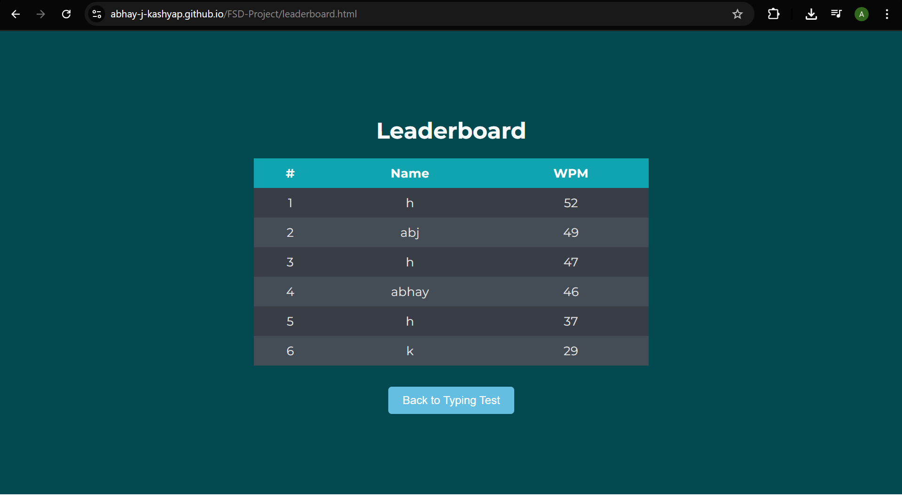

# Typing Speed Tester

This project is a web-based application designed to test and measure a user's typing speed in Words Per Minute (WPM). It provides real-time feedback on typing accuracy and features a persistent leaderboard to track high scores.

**[Live Demo](https://abhay-j-kashyap.github.io/FSD-Project/)**

## Features

* **Real-time Typing Test:** Users are given a random sentence to type from a predefined list.
* **Instant Accuracy Feedback:** As the user types, each word is highlighted in green (correct) or red (incorrect).
* **WPM Calculation:** Once the test is complete, the application calculates and displays the user's typing speed in WPM and shows the total number of correct words.
* **Persistent Leaderboard:** After completing a test, users are prompted to enter their name to save their score.
* **Local Storage:** All scores are saved in the browser's `localStorage`, ensuring data persists between sessions.
* **Ranked Scoreboard:** A separate leaderboard page (`leaderboard.html`) fetches and displays all saved scores, automatically sorted from highest WPM to lowest.
* **Clean & Responsive UI:** The application features a modern, dark-themed, and responsive design suitable for various screen sizes.

## How It Works

### Main Test Page (`index.html`)

1.  **Start Test:** When the user clicks the "Start" button, `script.js` selects a random sentence, displays it, and starts a timer (`startTime`).
2.  **Typing Input:** The user types into a `contenteditable` `div` element. An `input` event listener tracks their progress.
3.  **Word Tracking:** The script splits the user's input and compares it word-by-word to the source sentence. It then updates the `word-tracker` paragraph with `<span>` elements, applying `.correct` or `.incorrect` classes for styling.
4.  **Test Completion:** The test ends when the user has typed the same number of words as the sentence and presses the spacebar after the last word.
5.  **Score Calculation:** The end time is captured, and the WPM is calculated using the formula: `(total_words / time_in_seconds) * 60`.
6.  **Saving Score:** The user is prompted for their name. A new score object `{ name, score }` is created, added to the `scores` array, sorted in descending order, and saved to `localStorage`.

### Leaderboard Page (`leaderboard.html`)

1.  **Page Load:** When `leaderboard.html` is loaded, the `leaderboard.js` script executes.
2.  **Fetch Scores:** The script retrieves the `scores` array from `localStorage`.
3.  **Populate Table:** It then iterates through the scores array and dynamically creates and inserts table rows (`<tr>`) into the `leaderboard-list` table body, displaying the rank, name, and WPM for each entry.
4.  **Navigation:** A "Back to Typing Test" button allows the user to easily navigate back to `index.html`.

## Screenshots



## Technologies Used

* **HTML5**
* **CSS3**
    * **Google Fonts** (Montserrat)
    * Flexbox for layout
* **JavaScript (ES6+)**
    * DOM Manipulation
    * Event Listeners
    * Browser `localStorage` API for client-side data persistence
    * ES6 Modules (`type="module"`)

## How to Run Locally

This project consists of static files and does not require a complex build process. However, because it uses ES6 modules (`type="module"`), you must run it from a local web server to avoid CORS errors.

1.  **Clone the repository:**
    ```bash
    git clone [https://github.com/Abhay-J-Kashyap/FSD-Project.git](https://github.com/Abhay-J-Kashyap/FSD-Project.git)
    ```

2.  **Navigate to the project directory:**
    ```bash
    cd FSD-Project
    ```

3.  **Start a simple local server:**
    If you have Python 3 installed, you can run:
    ```bash
    python -m http.server
    ```
    Alternatively, if you have Node.js, you can use the `serve` package:
    ```bash
    npx serve
    ```

4.  **Open in browser:**
    Open your web browser and navigate to `http://localhost:8000` (or the port specified by your server).
